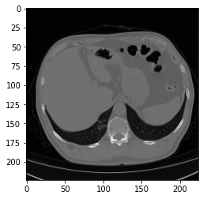
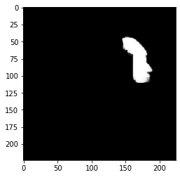

# Chest-CTs-image-segmentation-with-UNET
This project provided an efficient Unet network to detect damaged lung tissues. The proposed network is implemented with the PyTorch framework and trained with the Adam optimizer function over 20 epochs. The segmentation results are illustrated below.

